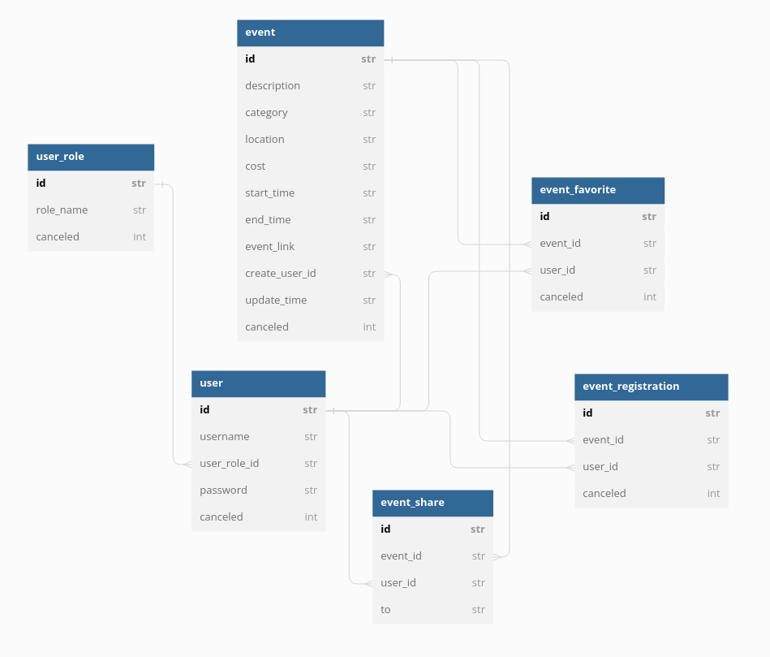

# isea-backend
The backend repository for isea

## Table Diagram

## Endpoints
**Users**   
→ **/users GET** : Get all users    
→ **/users POST** : Create a user   
→ **/users/{id} GET** : Get a user    
→ **/users/{id}/favorite GET** : Get a users favorite events    
→ **/users/{id}/registration GET** : Get a users event registrations    
→ **/users/login POST** : Login a user    
→ **/users/roles GET** : Get user roles   
→ **/users/roles POST** : Create a user role    

**Events**    
→ **/events GET** : Get all events    
→ **/events POST** : Create an event    
→ **/events/{id} GET** : Get an event   
→ **/events/{id} POST** : Update an event   
→ **/events/registration POST** : Register to an event    
→ **/events/registration/{id} POST** : Unregister from an event   
→ **/events/favorite POST** : Favorite an event   
→ **/events/favorite/{id} POST** : Remove a favorite    
→ **/events/share POST** : Share an event   
→ **/events/{id}/metrics GET** : Get an events metrics   
